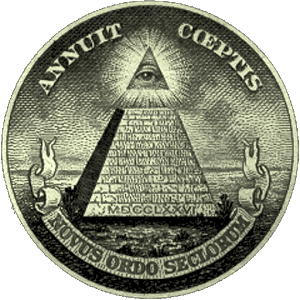
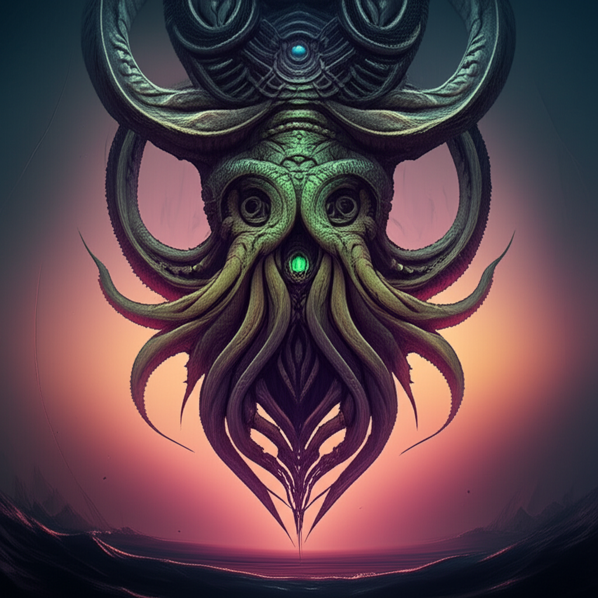
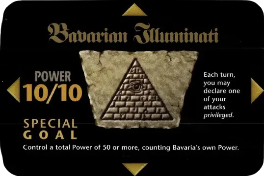
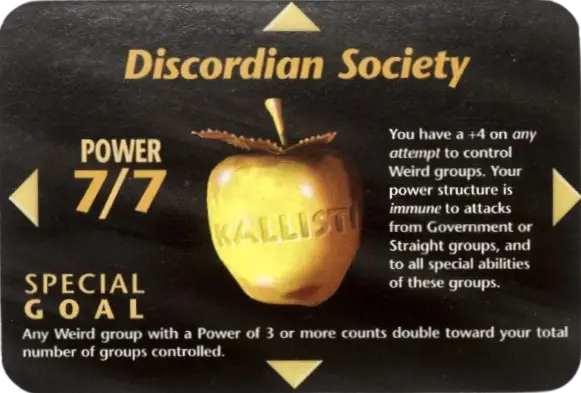
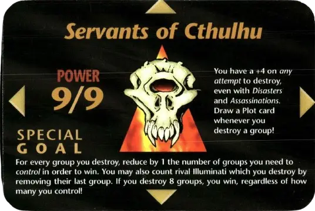

<p align="center">
  
</p>

<h1 align="center">INWO - Illuminati: New World Order</h1>
<p align="center"><em>The Ultimate Conspiracy Card Game</em></p>

---

## 👁️ About

**INWO** (Illuminati: New World Order) is a digital reimagining of the cult classic conspiracy card game. Take control of secret societies, manipulate world events, and outwit your rivals in a battle for global domination. Every card is a plot, every move a step deeper into the shadows...

---

## 🕹️ Features

- 🔥 **Animated Hero Section** with glitch and fire effects
- 🃏 **Deck Builder**: Create and manage your own conspiracy deck
- 🏛️ **Factions**: Choose from iconic secret societies, each with unique powers
- 🎴 **Card Art**: Faithful digital versions of the original cards
- 🌑 **Dark, Mysterious UI**: Inspired by the occult and secret societies
- ⚡ **Responsive & Modern**: Built with Next.js, React, and Tailwind CSS

---

## 🚀 Getting Started

```bash
# Install dependencies
npm install

# Run the development server
npm run dev

# Build for production
npm run build
```

Open [http://localhost:3000](http://localhost:3000) to see the app in action.

---

## 🏆 Factions

<p align="center">
  
  
  
  
  
  
  
  
  
  
</p>

---

## ✨ Screenshots

<p align="center">
  
  
  
</p>

---

## 🛠️ Tech Stack

- **Next.js** / **React**
- **Tailwind CSS**
- **TypeScript**
- **Radix UI**
- **Custom Canvas Animations**

---

## 📜 License

This project is a fan-made, non-commercial tribute to the original INWO card game. All card art and names are property of their respective owners.

---

<p align="center">
  <strong>“The truth is out there. Will you control it?”</strong>
</p>
